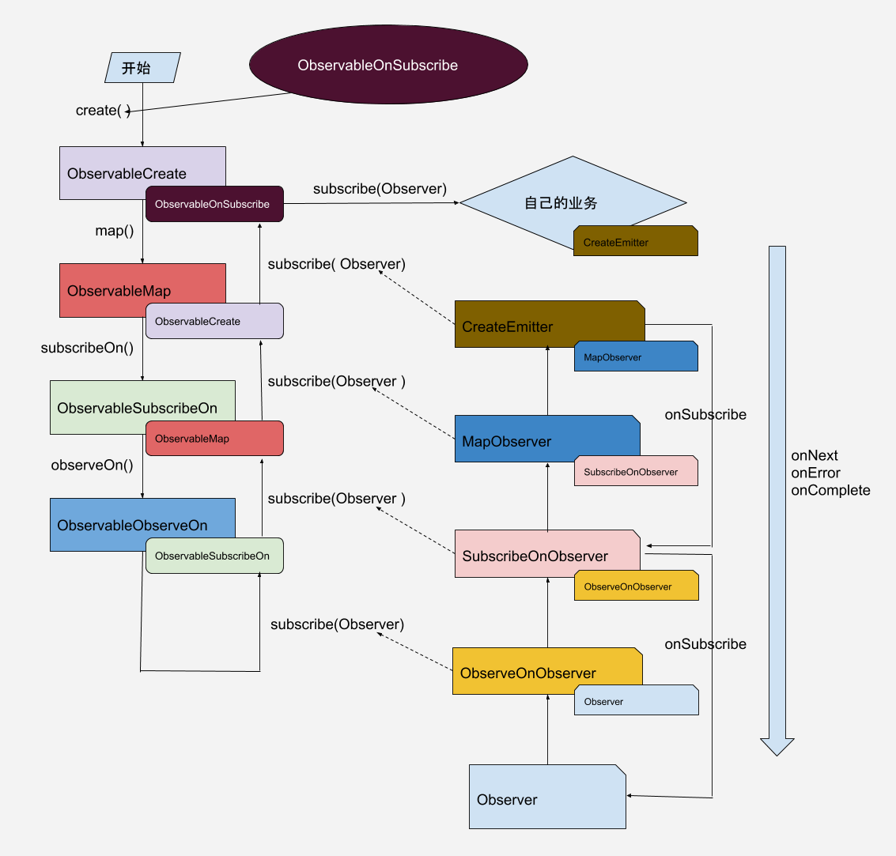

[两张图彻底理解 RxJava2 的核心原理](http://solart.cc/2020/06/16/understand_rxjava2/)

## 响应式编程
是一种基于异步数据流概念的编程模式。数据流就像一条河：它可以被观测，被过滤，被操作，或者为新的消费者与另外一条流合并为一条新的流

## RXJava
一个在 Java VM 上使用可观测的序列来组成异步的、基于事件的程序的库

## observer,observable
observer观察者，是做出反应，observable被观察者，是发出数据流的

- Flowable （被观察者）/ Subscriber （观察者），支持背压

- Observable ( 被观察者 ) / Observer ( 观察者 )，不支持背压

## 背压，
Backpressure,上游发送事件的速度大于下游处理事件的速度所产生的现象。5中背压策略

## 操作符

- 创建just,from

- 变换map,flatmap,contractmap,cast

    - flatmap 把每个一组变成一组

- 过滤filter,distinct,skip,take

- 组合merge,contact,zip

- 辅助delay,do是添加回调

# 源码

- observable 有subscribe方法，传入observer时才开始发送数据，subscibe调用subscribleActual会生成createEmitter，createEmitter是怎么发数据已经回调给用户操作，createEmitter的onNext方法会调用observer的onNext方法等，subscribeActual是订阅的开始，所以订阅都是从下到上的

- map等操作符就是装饰模式，先要执行function在执行onNext。

    - function就是一进一出，怎么转换已经回调给用户处理.

    - 对应产生的被观察者和观察者命名规则很有规律，比如说被观察者的命名 Observable + 操作符 ，例如 ObservableMap = Observable + map，观察者命名大多遵循 操作符 + Observer ，例如 FlatMapObserver = flatMap + Observer。除了命名规则外，我们观察整个流程，你也会发现有两个包裹封装的过程，一个是按照代码顺序的操作符产生了一个一层层的数据源包裹，另外一个是在逆向订阅时，将观察者按照订阅顺序打包成一个一层层的观察者包裹。subscribeActual是source.subcrebe(observer(acture))

    - AbstractObservableWithUpstream所有操作符的基类，subscrible处理好上下流的关系.自定义操作符的关键

- 线程切换

    - subscribeOn()

         - ObservableSubscribeOn 本身就是在 subscribeActual 中将上层数据源在异步线程中执行订阅，这样就完成了线程的切换，后续的流程都会在这个切换后的线程中执行，直到再次切换线程。

         - subscribeOn只有第一个指定的切换有效，多次设置是无效的。而observeOn则是每次切换都有效。

    - observerOn(),执行后是得到 ObservableObserveOn 对象

         - Scheduler.Worker w = scheduler.createWorker();

         - ObservableObserveOn implements Observer<T>, Runnable,ObservableObserveOn的 onNext 处理会执行schedule，根据传入的线程包装的worker是执行包裹的rununalbe， ScheduledRunnable sr = new ScheduledRunnable(decoratedRun, parent);f = executor.submit((Callable<Object>)sr);

- subject,transform,compose

    - subject可以是数据源observerable，也可以是数据的订阅者Observer

    - compose,transform

         - Transformer 能够将一个 Observable/Flowable/Single/Completable/Maybe 对象转换成另一个 Observable/Flowable/Single/Completable/Maybe 对象，和调用一系列的内联操作符是一模一样的。

              - Single

              - Completable

              - Maybe

         - compose操作于整个数据流中，能够从数据流中得到原始的Observable/Flowable...当创建Observable/Flowable...时，compose操作符会立即执行，而不像其他的操作符需要在onNext()调用后才执行。

